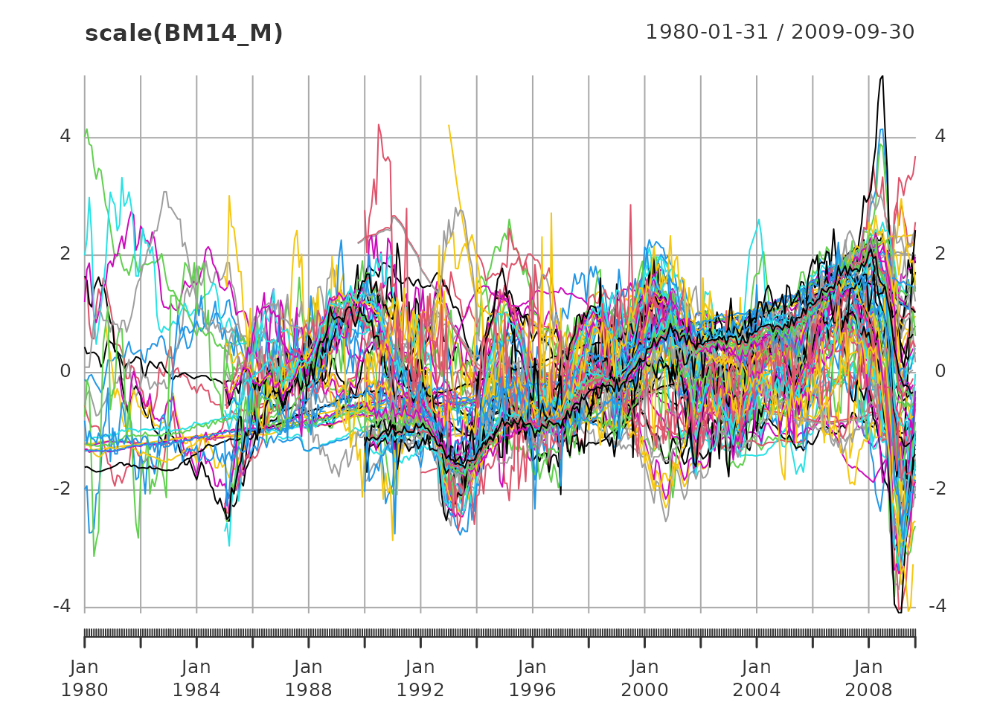
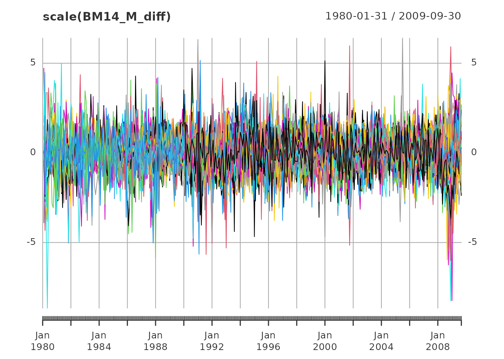
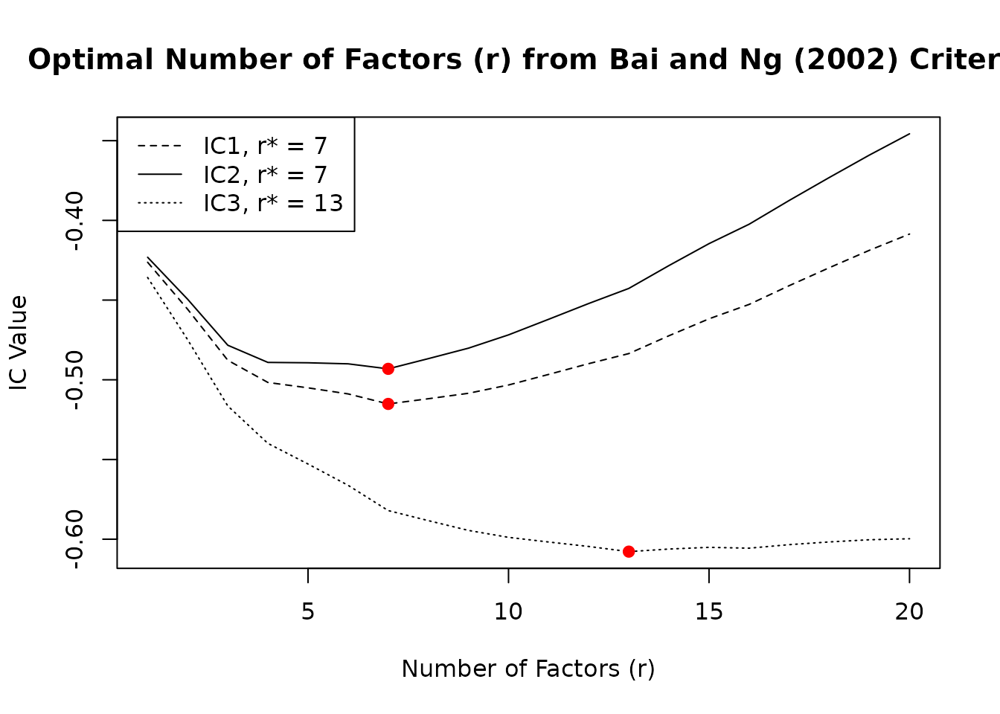
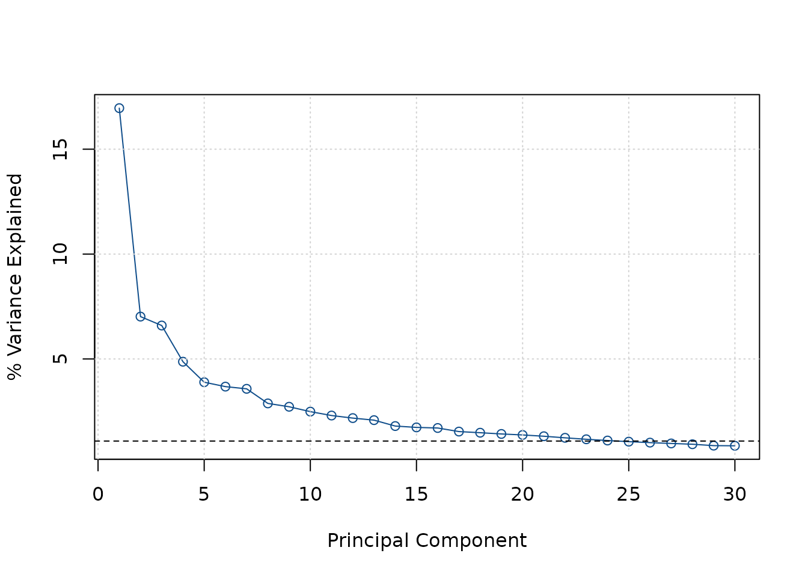
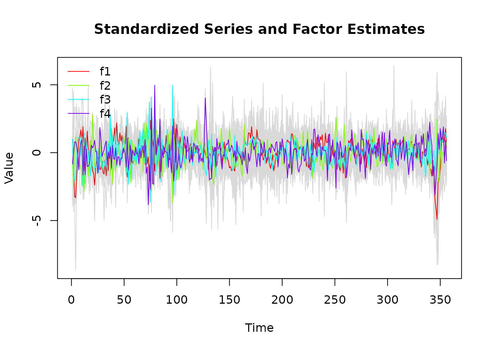
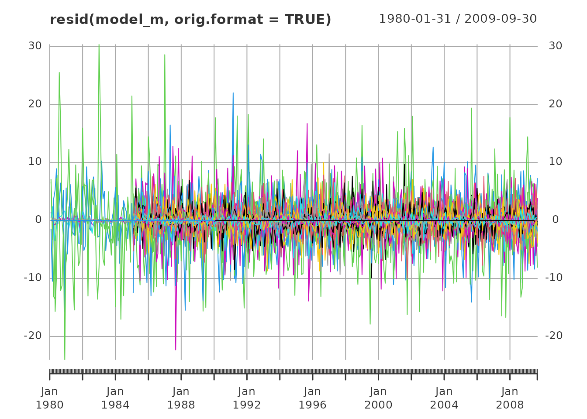
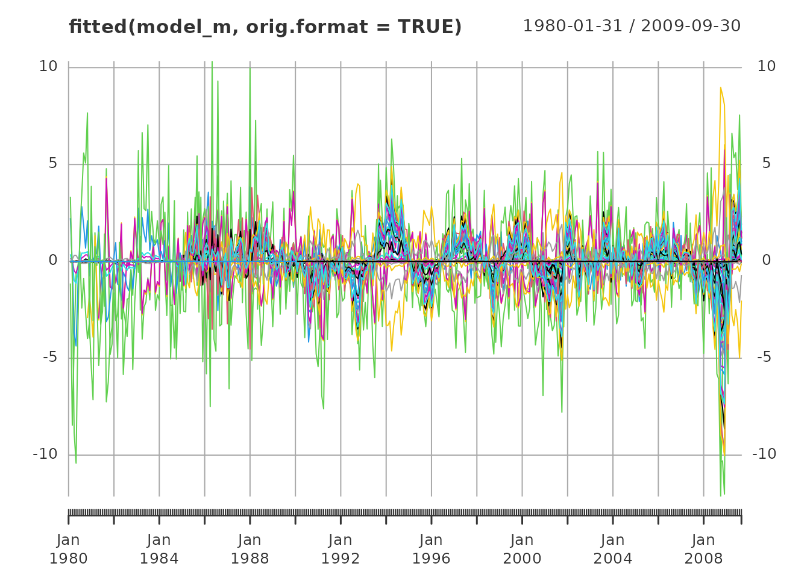
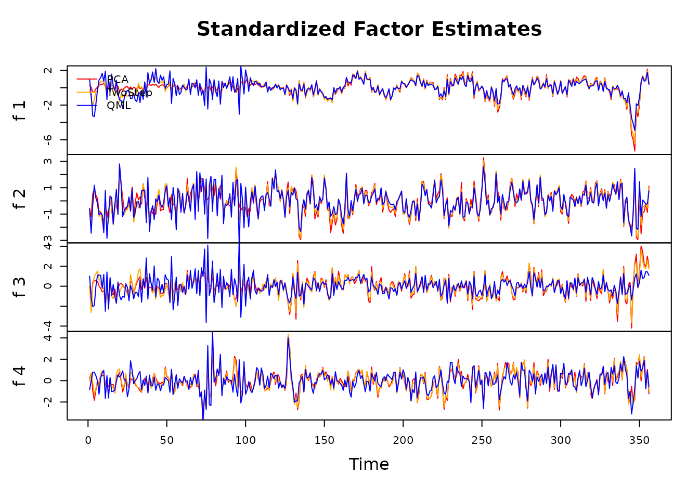
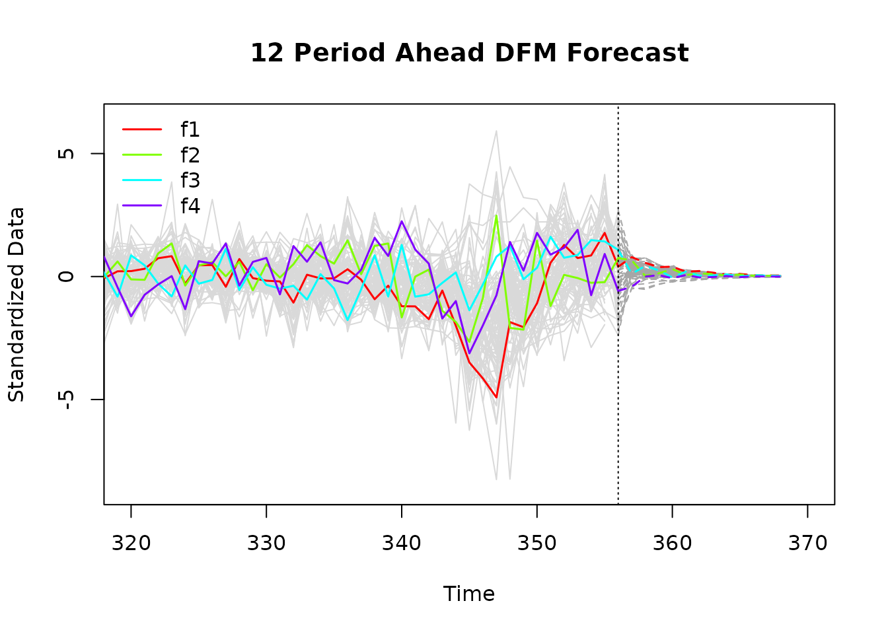
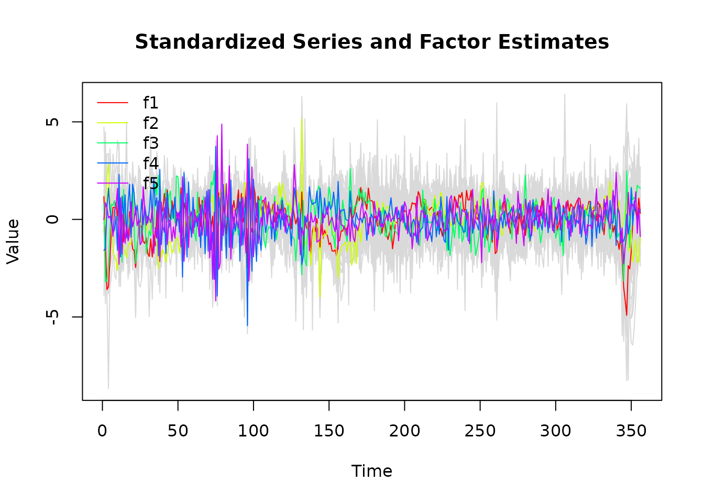

# Introduction to dfms

*dfms* provides a user friendly and computationally efficient approach
to estimate linear Gaussian Dynamic Factor Models in R. The package is
not geared at any specific application, and can be used for
dimensionality reduction, forecasting and nowcasting systems of time
series. The use of the package is facilitated by a comprehensive set of
methods to explore/plot models and extract results.

``` r
library(dfms)
library(xts)
```

This vignette walks through the main features of the package. The data
provided in the package in *xts* format is taken from Banbura and
Modugno (2014)[¹](#fn1), henceforth BM14, and covers the Euro Area from
January 1980 through September 2009.

``` r
# Using the monthly series from BM14
dim(BM14_M)
#> [1] 357  92
range(index(BM14_M))
#> [1] "1980-01-31" "2009-09-30"
head(colnames(BM14_M))
#> [1] "ip_total"       "ip_tot_cstr"    "ip_tot_cstr_en" "ip_constr"     
#> [5] "ip_im_goods"    "ip_capital"
plot(scale(BM14_M), lwd = 1)
```



The data frame `BM14_Models` provides information about the
series[²](#fn2), and the various models estimated by BM14.

``` r
head(BM14_Models, 3)
#>           series
#> 1       ip_total
#> 2    ip_tot_cstr
#> 3 ip_tot_cstr_en
#>                                                                                           label
#> 1                                       IP-Total Industry - Working Day and Seasonally Adjusted
#> 2              IP-Total Industry (Excluding Construction) - Working Day and Seasonally Adjusted
#> 3 IP-Total Industry Excluding Construction and MIG Energy - Working Day and Seasonally Adjusted
#>                           code freq log_trans small medium large
#> 1 sts.m.i5.Y.PROD.NS0010.4.000    M      TRUE FALSE  FALSE  TRUE
#> 2 sts.m.i5.Y.PROD.NS0020.4.000    M      TRUE  TRUE   TRUE  TRUE
#> 3 sts.m.i5.Y.PROD.NS0021.4.000    M      TRUE FALSE  FALSE  TRUE

# Using only monthly data
BM14_Models_M <- subset(BM14_Models, freq == "M")
```

Prior to estimation, all data is differenced by BM14, and some series
are log, differenced, as indicated by the `log_trans` column in
`BM14_Models`. In general, *dfms* uses a stationary Kalman Filter with
time-invariant system matrices, and therefore expects data to be
stationary. Data is also scaled and centered[³](#fn3) in the main
[`DFM()`](https://sebkrantz.github.io/dfms/reference/DFM.md) function,
thus this does not need to be done by the user.

``` r
library(magrittr)
# log-transforming and first-differencing the data
BM14_M[, BM14_Models_M$log_trans] %<>% log()
BM14_M_diff <- diff(BM14_M)
plot(scale(BM14_M_diff), lwd = 1)
```



## Determining the Structure of the Model

Before estimating a model, the
[`ICr()`](https://sebkrantz.github.io/dfms/reference/ICr.md) function
can be applied to determine the number of factors. It computes 3
information criteria proposed in Bai and NG (2002)[⁴](#fn4), whereby the
second criteria generally suggests the most parsimonious model.

``` r
ic <- ICr(BM14_M_diff)
#> Missing values detected: imputing data with tsnarmimp() with default settings
print(ic)
#> Optimal Number of Factors (r) from Bai and Ng (2002) Criteria
#> 
#> IC1 IC2 IC3 
#>   7   7  13
plot(ic)
```



Another option is to use a Screeplot to gauge the number of factors by
looking for a kink in the plot. A mathematical procedure for finding the
kink was suggested by Onatski (2010)[⁵](#fn5), but this is currently not
implemented in
[`ICr()`](https://sebkrantz.github.io/dfms/reference/ICr.md).

``` r
screeplot(ic)
```



Based on both the information criteria and the Screeplot, I gauge that a
model with 4 factors should be estimated, as factors, 5, 6 and 7 do not
add much to the explanatory power of the model. Next to the number of
factors, the lag order of the factor-VAR of the transition equation
should be estimated (the default is 1 lag). This can be done using the
[`VARselect()`](https://rdrr.io/pkg/vars/man/VARselect.html) function
from the *vars* package, with PCA factor estimates reported by
[`ICr()`](https://sebkrantz.github.io/dfms/reference/ICr.md).

``` r
# Using vars::VARselect() with 4 principal components to estimate the VAR lag order
vars::VARselect(ic$F_pca[, 1:4])
#> $selection
#> AIC(n)  HQ(n)  SC(n) FPE(n) 
#>      6      3      3      6 
#> 
#> $criteria
#>                 1          2          3          4          5          6
#> AIC(n)   5.810223   5.617282   5.427760   5.389413   5.407765   5.381829
#> HQ(n)    5.898758   5.776646   5.657953   5.690434   5.779614   5.824507
#> SC(n)    6.032560   6.017490   6.005838   6.145361   6.341582   6.493517
#> FPE(n) 333.696100 275.153456 227.671078 219.144228 223.265640 217.639133
#>                 7          8          9         10
#> AIC(n)   5.409877   5.394900   5.421375   5.460761
#> HQ(n)    5.923383   5.979235   6.076538   6.186753
#> SC(n)    6.699434   6.862328   7.066673   7.283929
#> FPE(n) 223.956824 220.793226 226.933863 236.331677
```

The selection thus suggests we should estimate a factor model with
`r = 4` factors and `p = 3` lags[⁶](#fn6). Before estimating the model I
note that *dfms* does not deal with seasonality in series, thus it is
recommended to also seasonally adjust data, e.g. using the *seasonal*
package before estimation. BM14 only use seasonally adjusted series,
thus this is not necessary with the example data provided.

## Estimation and Exploration

Estimation can then simply be done using the
[`DFM()`](https://sebkrantz.github.io/dfms/reference/DFM.md) function
with parameters `r` and `p`[⁷](#fn7).

``` r
# Estimating the model with 4 factors and 3 lags using BM14's EM algorithm
model_m <- DFM(BM14_M_diff, r = 4, p = 3)
#> Converged after 26 iterations.
print(model_m)
#> Dynamic Factor Model: n = 92, T = 356, r = 4, p = 3, %NA = 25.8366
#> 
#> Factor Transition Matrix [A]
#>      L1.f1   L1.f2   L1.f3   L1.f4   L2.f1   L2.f2   L2.f3   L2.f4   L3.f1
#> f1  0.4720 -0.1297  0.8460  0.2098 -0.0733 -0.1436 -0.0595  0.1565  0.2356
#> f2 -0.1612  0.1699  0.2389  0.1598  0.0641 -0.1341 -0.0542  0.1287  0.1336
#> f3  0.3965  0.3264  0.0213 -0.3033 -0.1542 -0.0467 -0.1484 -0.0150 -0.1172
#> f4  0.1096  0.1601 -0.1578  0.2485 -0.0365 -0.0563 -0.0230 -0.1117 -0.0719
#>      L3.f2   L3.f3   L3.f4
#> f1 -0.0803 -0.0386  0.0408
#> f2  0.1347 -0.0024 -0.0342
#> f3 -0.0087  0.1767  0.0249
#> f4  0.0307  0.0662 -0.0035
plot(model_m)
```



The model can be investigated using
[`summary()`](https://rdrr.io/pkg/urca/man/summary-methods.html), which
returns an object of class ‘dfm_summary’ containing the system matrices
and summary statistics of the factors and the residuals in the
measurement equation, as well as the R-Squared of the factor model for
individual series. The print method automatically adjusts the amount of
information printed to the data size. For large databases with more than
40 series, no series-level statistics are printed.

``` r
dfm_summary <- summary(model_m)
print(dfm_summary) # Large model with > 40 series: defaults to compact = 2
#> Dynamic Factor Model: n = 92, T = 356, r = 4, p = 3, %NA = 25.8366
#> 
#> Call:  DFM(X = BM14_M_diff, r = 4, p = 3)
#> 
#> Summary Statistics of Factors [F]
#>       N     Mean   Median      SD       Min      Max
#> f1  356  -0.0448   0.3455  4.4505  -21.9265  11.0306
#> f2  356  -0.0319  -0.0892    2.68   -9.9549   7.4988
#> f3  356  -0.1032  -0.0593  3.2891  -12.0969  16.2455
#> f4  356  -0.0118    0.089   2.161   -8.2883  10.7219
#> 
#> Factor Transition Matrix [A]
#>      L1.f1   L1.f2    L1.f3   L1.f4    L2.f1    L2.f2    L2.f3    L2.f4   L3.f1
#> f1  0.4720 -0.1297  0.84605  0.2098 -0.07334 -0.14356 -0.05950  0.15645  0.2356
#> f2 -0.1612  0.1699  0.23889  0.1598  0.06406 -0.13413 -0.05415  0.12869  0.1336
#> f3  0.3965  0.3264  0.02128 -0.3033 -0.15424 -0.04669 -0.14839 -0.01495 -0.1172
#> f4  0.1096  0.1601 -0.15776  0.2485 -0.03655 -0.05626 -0.02304 -0.11169 -0.0719
#>        L3.f2     L3.f3     L3.f4
#> f1 -0.080320 -0.038592  0.040812
#> f2  0.134692 -0.002391 -0.034215
#> f3 -0.008694  0.176663  0.024876
#> f4  0.030716  0.066201 -0.003465
#> 
#> Factor Covariance Matrix [cov(F)]
#>           f1        f2        f3        f4
#> f1  19.8067    2.0846*  -3.4700*  -2.1094*
#> f2   2.0846*   7.1822   -2.8725*  -1.0631*
#> f3  -3.4700*  -2.8725*  10.8182    1.9286*
#> f4  -2.1094*  -1.0631*   1.9286*   4.6701 
#> 
#> Factor Transition Error Covariance Matrix [Q]
#>         u1      u2      u3      u4
#> u1  9.0178  0.3303 -3.0764 -1.0182
#> u2  0.3303  5.4425 -1.3095 -0.5051
#> u3 -3.0764 -1.3095  7.0230  0.8639
#> u4 -1.0182 -0.5051  0.8639  3.8005
#> 
#> Summary of Residual AR(1) Serial Correlations
#>    N     Mean   Median      SD      Min     Max
#>   92  -0.0409  -0.0782  0.2959  -0.5073  0.6858
#> 
#> Summary of Individual R-Squared's
#>    N    Mean  Median      SD     Min     Max
#>   92  0.3712   0.299  0.2888  0.0067  0.9978

# Can request more detailed printouts
# print(dfm_summary, compact = 1)
# print(dfm_summary, compact = 0) 
```

Apart from the model summary, the *dfm* methods
[`residuals()`](https://rdrr.io/r/stats/residuals.html) and
[`fitted()`](https://rdrr.io/r/stats/fitted.values.html) return
observation residuals and fitted values from the model. The default
format is a plain matrix, but the functions also have an argument to
return data in the original (input) format.

``` r
plot(resid(model_m, orig.format = TRUE), lwd = 1)
```



``` r
plot(fitted(model_m, orig.format = TRUE), lwd = 1)
```



Another way to examine the factor model visually is to plot the
Quasi-Maximum-Likelihood (QML) factor estimates against PCA and Two-Step
estimates following Doz, Giannone and Reichlin (2011)[⁸](#fn8), where
the Kalman Filter and Smoother is run only once. Both estimates are also
computed by [`DFM()`](https://sebkrantz.github.io/dfms/reference/DFM.md)
during EM estimation and can also be visualized with `plot.dfm`.

``` r
plot(model_m, method = "all", type = "individual")
```



The plot with the various estimates shows that the QML estimates are
more volatile in the initial periods where there are many missing
series, but less volatile in the latter periods. In general, QML
estimates may not always be superior across the entire data range to
Two-Step and PCA estimates. Often, Two-Step estimates also provide
similar forecasting performance, and are much faster to estimate using
`DFM(BM14_M_diff, r = 4, p = 3, em.method = "none")`.

The factor estimates themselves can be extracted in a data frame using
[`as.data.frame()`](https://rdrr.io/r/base/as.data.frame.html), which
also provides various options regarding the estimates retained and the
format of the frame. It is also possible to add a time variable from the
original data (the default is a sequence of integers).

``` r
# Default: all estimates in long format
head(as.data.frame(model_m, time = index(BM14_M_diff)))
#>   Method Factor       Time      Value
#> 1    PCA     f1 1980-02-29  1.1503013
#> 2    PCA     f1 1980-03-31  0.3374613
#> 3    PCA     f1 1980-04-30 -1.4905337
#> 4    PCA     f1 1980-05-31 -1.5360036
#> 5    PCA     f1 1980-06-30 -0.2828433
#> 6    PCA     f1 1980-07-31  0.3385403
```

## Forecasting

DFM forecasts can be obtained with the
[`predict()`](https://rdrr.io/r/stats/predict.html) method, which
dynamically forecasts the factors using the transition equation (default
10 periods), and then also predicts data forecasts using the observation
equation. Objects are of class ‘dfm_forecast’.

``` r
# 12-period ahead DFM forecast
fc <- predict(model_m, h = 12)
print(fc)
#> 12 Step Ahead Forecast from Dynamic Factor Model
#> 
#> Factor Forecasts
#>        f1     f2      f3      f4
#> 1  3.4698 1.7276  0.2706 -0.9064
#> 2  2.4379 0.0305  1.3119 -0.0097
#> 3  1.6576 0.3182  0.7247  0.1037
#> 4  1.7445 0.7829 -0.2230 -0.1513
#> 5  0.8281 0.1390  0.5545  0.1199
#> 6  0.9576 0.3001  0.0126 -0.0923
#> 7  0.6599 0.2489  0.0333 -0.0518
#> 8  0.3354 0.0681  0.1999  0.0332
#> 9  0.4286 0.1824 -0.0830 -0.0672
#> 10 0.1853 0.0605  0.0882  0.0107
#> 11 0.1605 0.0544  0.0268 -0.0067
#> 12 0.1509 0.0734 -0.0288 -0.0235
#> 
#> Series Forecasts
#>    ip_total ip_tot_cstr ip_tot_cstr_en ip_constr ip_im_goods ip_capital
#> 1    0.7985      0.7887         0.8726    0.1194      0.7258     0.7111
#>    ip_d_cstr ip_nd_cons   ip_en ip_en_2 ip_manuf ip_metals ip_chemicals
#> 1     0.5883     0.5218  0.0374  0.0929   0.8833    0.5871       0.4322
#>    ip_electric ip_machinery ip_paper ip_plastic new_cars orders
#> 1       0.7411       0.5961   0.4887     0.6648  -0.0008 0.5094
#>    ret_turnover_defl ecs_ec_sent_ind ecs_ind_conf ecs_ind_order_book
#> 1            -0.0084          0.7389       0.6889             0.6802
#>    ecs_ind_stocks ecs_ind_prod_exp ecs_ind_prod_rec_m ecs_ind_x_orders
#> 1         -0.4598           0.5100             0.4842           0.5767
#>    ecs_ind_empl_exp ecs_cons_conf ecs_cons_sit_over_next_12 ecs_cons_exp_unempl
#> 1            0.5251        0.5918                    0.5372             -0.4983
#>    ecs_cons_gen_last_12m ecs_cstr_conf ecs_cstr_order_books ecs_cstr_empl_exp
#> 1                 0.6448        0.3574               0.2607            0.3097
#>    ecs_cstr_prod_recent ecs_ret_tr_conf ecs_ret_tr_bus_sit ecs_ret_tr_stocks
#> 1                0.2582          0.2149             0.1320           -0.0292
#>    ecs_ret_tr_exp_bus ecs_ret_tr_empl ecs_serv_conf ecs_serv_empl_exp
#> 1              0.2545          0.1380        0.4420            0.3889
#>    pms_comp_output pms_comp_empl pms_pmi pms_manuf_empl pms_manuf_output
#> 1           0.5143        0.4510  0.4805         0.5285           0.4470
#>    pms_manuf_product pms_serv_out pms_serv_empl pms_serv_new_bus
#> 1             0.2551       0.4515        0.3026           0.4434
#>    pms_serv_product     urx empl_total empl_tot_xc empl_cstr empl_manuf
#> 1            0.2254 -0.4247     0.4582      0.2921    0.5706     0.3040
#>    extra_ea_trade_exp_val intra_ea_trade_exp_val extra_ea_trade_imp_val
#> 1                  0.3859                 0.3464                 0.1529
#>    intra_ea_trade_imp_val  us_ip  us_urx us_empl us_retail_sales
#> 1                  0.3410 0.3363 -0.3407  0.2387          0.1015
#>    us_ip_manuf_exp us_cons_exp us_r3_m us_r10_year
#> 1           0.0451      0.0759  0.2387      0.1474
#>  [ reached 'max' / getOption("max.print") -- omitted 11 rows and 22 columns ]
```

These forecasts can also be visualized using a plot method. By default
the entire series history is plotted along with the forecasts, thus it
is often helpful to restrict the plot range. As with any stationary
autoregressive model, the forecasts tend to zero quite quickly[⁹](#fn9).

``` r
# Setting an appropriate plot range to see the forecast
plot(fc, xlim = c(320, 370))
```



By default, [`predict()`](https://rdrr.io/r/stats/predict.html) uses the
QML factor estimates (if available). We can however also predict with
PCA or TwoStep estimates using, e.g.,
`predict(model_m, h = 12, method = "2s")`.

The forecasts can be retrieved in data frame using
[`as.data.frame()`](https://rdrr.io/r/base/as.data.frame.html). Again
the method has various arguments to control the output (factors, data,
or both — default factors) and the format of the frame.

``` r
# Factor forecasts in wide format
head(as.data.frame(fc, pivot = "wide"))
#>   Time Forecast         f1         f2         f3          f4
#> 1    1    FALSE   4.207651 -1.6552707  3.2190834 -1.82663141
#> 2    2    FALSE  -3.656458 -6.6178403 -3.9121446 -0.05762001
#> 3    3    FALSE -14.486337 -0.6573393 -6.8663850  1.69525122
#> 4    4    FALSE -14.794458  3.1573790 -6.4820328  1.70916785
#> 5    5    FALSE  -8.191696  0.5563773 -0.1840816  0.98407541
#> 6    6    FALSE  -1.357927 -0.3805697  3.5068964 -0.05346754
```

## Estimation with Mixed Frequency

Since v0.3.0, *dfms* allows monthly and quarterly mixed frequency
estimation following Mariano & Murasawa (2003) and Banbura & Modugno
(2014). Quarterly variables should be to the right of the monthly
variables in the data matrix and need to be indicated using the
`quarterly.vars` argument. Quarterly observations should be provided
every 3rd period (months 3, 6, 9, and 12). Below, I estimate the mixed
frequency DFM, adding a factor to capture any idiosynchratic dynamics in
the quarterly series.

``` r
# Quarterly series from BM14
head(BM14_Q, 3)
#>                gdp priv_cons   invest   export   import     empl prductivity
#> 1980-03-31 1092266  639100.2 238798.3 212326.1 208414.9 118296.6          NA
#> 1980-06-30 1087137  635191.5 234788.5 203062.0 202807.3 118366.6          NA
#> 1980-09-30 1086518  639791.6 233879.2 200720.5 204375.7 118370.7          NA
#>            capacity gdp_us
#> 1980-03-31       NA 5908.5
#> 1980-06-30       NA 5787.4
#> 1980-09-30       NA 5776.6
# Pre-processing the data
BM14_Q[, BM14_Models$log_trans[BM14_Models$freq == "Q"]] %<>% log()
BM14_Q_diff <- diff(BM14_Q)
# Merging to monthly data
BM14_diff <- merge(BM14_M_diff, BM14_Q_diff)

# Estimating the model with 5 factors and 3 lags using BM14's EM algorithm
model_mq <- DFM(BM14_diff, r = 5, p = 3, quarterly.vars = colnames(BM14_Q))
#> Converged after 36 iterations.
print(model_mq)
#> Mixed Frequency Dynamic Factor Model
#> n = 101, nm = 92, nq = 9, T = 356, r = 5, p = 3
#> %NA = 29.7363, %NAm = 25.8366
#> 
#> Factor Transition Matrix [A]
#>      L1.f1   L1.f2   L1.f3   L1.f4   L1.f5   L2.f1   L2.f2   L2.f3   L2.f4
#> f1  0.5038 -0.3564  0.5465 -0.4369  0.3457 -0.0386  0.1857 -0.2352 -0.0717
#> f2 -0.1115  0.4626 -0.1170 -0.0510  0.1261  0.0709 -0.0237  0.0141 -0.0754
#> f3  0.2327  0.0712  0.3584  0.0882 -0.1481 -0.0833 -0.0375 -0.2140  0.1724
#> f4 -0.2951 -0.1211  0.1017 -0.1605  0.4420  0.0247 -0.0919  0.0098 -0.1271
#>      L2.f5   L3.f1   L3.f2   L3.f3   L3.f4   L3.f5
#> f1  0.1943  0.2306  0.0015 -0.0119  0.0413  0.1004
#> f2  0.1047  0.1460  0.2557  0.0895 -0.0834  0.0474
#> f3 -0.0337 -0.0337 -0.0986  0.1048  0.1325 -0.0781
#> f4  0.1374  0.0543 -0.0733 -0.0256  0.0902 -0.0382
#>  [ reached 'max' / getOption("max.print") -- omitted 1 row ]
plot(model_mq)
```



## Additional Functions

*dfms* also exports central functions that help with DFM estimation,
such as imputing missing values with
[`tsnarmimp()`](https://sebkrantz.github.io/dfms/reference/tsnarmimp.md),
estimating a VAR with
[`.VAR()`](https://sebkrantz.github.io/dfms/reference/dot-VAR.md), or
Kalman Filtering and Smoothing with
[`SKFS()`](https://sebkrantz.github.io/dfms/reference/SKFS.md), or
separately with
[`SKF()`](https://sebkrantz.github.io/dfms/reference/SKF.md) followed by
[`FIS()`](https://sebkrantz.github.io/dfms/reference/FIS.md). To my
knowledge these are the fastest routines for simple stationary Kalman
Filtering and Smoothing currently available in R. The function
[`em_converged()`](https://sebkrantz.github.io/dfms/reference/em_converged.md)
can be used to check convergence of the log-likelihood in EM estimation.

*dfms* also exports a matrix inverse and pseudo-inverse from the
Armadillo C++ library through the functions
[`ainv()`](https://sebkrantz.github.io/dfms/reference/ainv.md) and
[`apinv()`](https://sebkrantz.github.io/dfms/reference/ainv.md). These
are often faster than [`solve()`](https://rdrr.io/r/base/solve.html),
and somewhat more robust in near-singularity cases.

## Conclusion and Outlook

*dfms* provides a simple but robust and powerful implementation of
dynamic factors models in R. For more information about the model
consult the [theoretical
vignette](https://raw.githubusercontent.com/SebKrantz/dfms/main/vignettes/dynamic_factor_models_paper.pdf).

Other implementations more geared to economic nowcasting applications
are provided in R packages
[*nowcasting*](https://github.com/nmecsys/nowcasting) and
[*nowcastDFM*](https://github.com/dhopp1/nowcastDFM). More general forms
of autoregressive state space models can be fit using
[*MARSS*](https://CRAN.R-project.org/package=MARSS). For large-scale
nowcasting models, the
[`DynamicFactorMQ`](https://www.statsmodels.org/dev/generated/statsmodels.tsa.statespace.dynamic_factor_mq.DynamicFactorMQ.html)
class in the *statsmodels* Python library provides a robust and
performant implementation.

In the future, a simple [`news()`](https://rdrr.io/r/utils/news.html)
function following Banbura and Modugno (2014) may be added to *dfms* to
evaluate the impact of new observations on model predictions. In
general, my time on this package is very limited, but the original
Matlab codes of Banbura and Modugno (2014) are [in the
repo](https://github.com/SebKrantz/dfms/tree/main/misc/BM2014). Thus,
impatient users are also very welcome to do advances and submit PRs.

## References

Doz, C., Giannone, D., & Reichlin, L. (2011). A two-step estimator for
large approximate dynamic factor models based on Kalman filtering.
*Journal of Econometrics, 164*(1), 188-205.

Doz, C., Giannone, D., & Reichlin, L. (2012). A quasi-maximum likelihood
approach for large, approximate dynamic factor models. *Review of
Economics and Statistics, 94*(4), 1014-1024.

Banbura, M., & Modugno, M. (2014). Maximum likelihood estimation of
factor models on datasets with arbitrary pattern of missing data.
*Journal of Applied Econometrics, 29*(1), 133-160.

Mariano, R. S., & Murasawa, Y. (2003). A new coincident index of
business cycles based on monthly and quarterly series. *Journal of
Applied Econometrics, 18*(4), 427-443.

Bai, J., Ng, S. (2002). Determining the Number of Factors in Approximate
Factor Models. *Econometrica, 70*(1), 191-221.

Onatski, A. (2010). Determining the number of factors from empirical
distribution of eigenvalues. *The Review of Economics and Statistics,
92*(4), 1004-1016.

Stock, J. H., & Watson, M. W. (2016). Dynamic Factor Models,
Factor-Augmented Vector Autoregressions, and Structural Vector
Autoregressions in Macroeconomics. *Handbook of Macroeconomics, 2*,
415–525.

------------------------------------------------------------------------

1.  Banbura, M., & Modugno, M. (2014). Maximum likelihood estimation of
    factor models on datasets with arbitrary pattern of missing data.
    *Journal of Applied Econometrics, 29*(1), 133-160.

2.  Both about the monthly ones and quarterly series contained in
    `BM14_Q`. The order of rows in `BM14_Models` matches the column
    order of series in `merge(BM14_M, BM14_Q)`.

3.  Data must be scaled and centered because the Kalman Filter has no
    intercept term.

4.  Bai, J., Ng, S. (2002). Determining the Number of Factors in
    Approximate Factor Models. *Econometrica, 70*(1), 191-221.
    <doi:10.1111/1468-0262.00273>

5.  Onatski, A. (2010). Determining the number of factors from empirical
    distribution of eigenvalues. *The Review of Economics and
    Statistics, 92*(4), 1004-1016.

6.  Some authors like Doz, Giannone, and Reichlin (2012) additionally
    allow the number of transition error processes, termed ‘dynamic
    factors’ and given an extra parameter `q`, to be less than the
    number of ‘static factors’ `r`. I find this terminology confusing
    and the feature not very useful for most practical purposes, thus I
    have not implemented it in *dfms*.

7.  Users can also choose from two different implementations of the EM
    algorithm using the argument `em.method`. The default is
    `em.method = "auto"`, which chooses the modified EM algorithm
    proposed by BM14 for missing data if `anyNA(X)`, and the plain EM
    implementation of Dos, Giannone and Reichlin (2012), henceforth
    DGR12, otherwise. The baseline implementation of DGR12 is typically
    more than 2x faster than BM14’s method, and can also be used with
    data that has a few random missing values (\< 5%), but gives wrong
    results with many and systematically missing data, such as ragged
    edges at the beginning of end of the sample or series at different
    frequencies. With complete datasets, both `em.method = "DGR"` and
    `em.method = "BM"` gives identical factor estimates, and in this
    case `em.method = "DGR"` should be used.

8.  Doz, C., Giannone, D., & Reichlin, L. (2011). A two-step estimator
    for large approximate dynamic factor models based on Kalman
    filtering. *Journal of Econometrics, 164*(1), 188-205.

9.  Depending also on the lag-order of the factor-VAR. Higher lag-orders
    product more interesting forecast dynamics.
